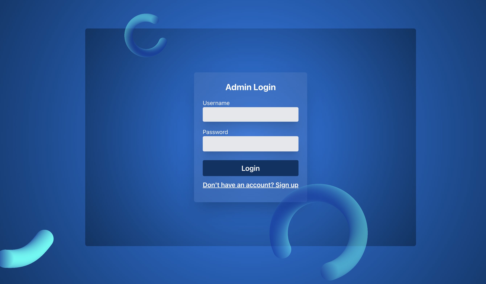

# Role-Based Access Control (RBAC) Project

This project is a Role-Based Access Control (RBAC) system with the following features:

- **Dashboard**: Admin can view an overview of activities, including the total number of users, roles, and a graphical representation of data.
- **Users Page**: Admin can add, delete, and edit user roles.
- **Role Page**: Admin can add, delete, and edit roles.
- **Permission Page**: Admin can add, delete, and edit permissions.
- **Login and Signup**:  
  - The **Signup** page allows new users to register, and they appear on the Users page after registration.
  - The **Login** page provides access to either the admin dashboard or a user-specific welcome page based on credentials.

---

## Installation

### Clone the Repository
```bash
git clone https://github.com/adityas-ops/rbac.git
cd rbac
```

### Install Dependencies

#### Using npm
```bash
npm i --force
```

#### Using Yarn
```bash
yarn
```

### Start the Project

1. Start the backend server:
   - **npm**:  
     ```bash
     npm run json-server --watch db.json --port 5001
     ```
   - **yarn**:  
     ```bash
     yarn json-server --watch db.json --port 5001
     ```

2. Start the frontend server in another terminal:
   - **npm**:  
     ```bash
     npm run dev
     ```
   - **yarn**:  
     ```bash
     yarn run dev
     ```

---

## How to Use

1. Open the project in a browser. By default, it starts at the login page.
2. To log in as an admin, use the following credentials:
   - **Username**: `admin`
   - **Password**: `1234`
3. The admin dashboard allows you to:
   - View an overview of activities.
   - Add, delete, or edit users, roles, and permissions.
4. To create a new user:
   - Click the **"Don't have an account?"** link on the login page.
   - Fill out the signup form.
   - After signing up, the user is redirected to the login page.
   - Login with the new user credentials to access the **Welcome** page, which is separate from the admin dashboard.
5. Admins can log out from the dashboard.
6. If you want to see database then use db.json file 

---

## Screenshots

1. **Dashboard Page**  
   

2.1 **Users Page Add**  
   

2.2 **Users Page Table**  
   

3. **Roles Page**  
   

4. **Permissions Page**  
   

5. **Login Page**  
   

6. **Signup Page**  
   

7. **Welcome Page**  
   

---

Enjoy managing your roles, users, and permissions efficiently with this RBAC system! 😊